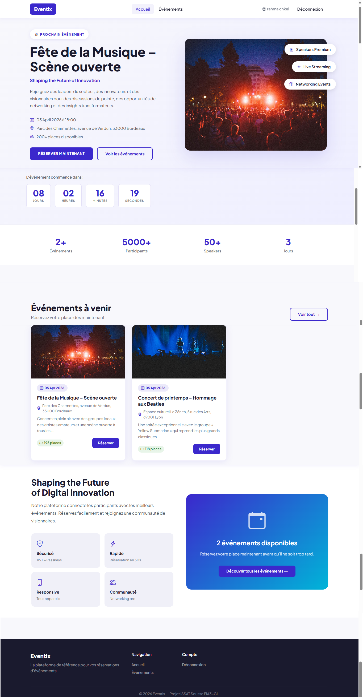
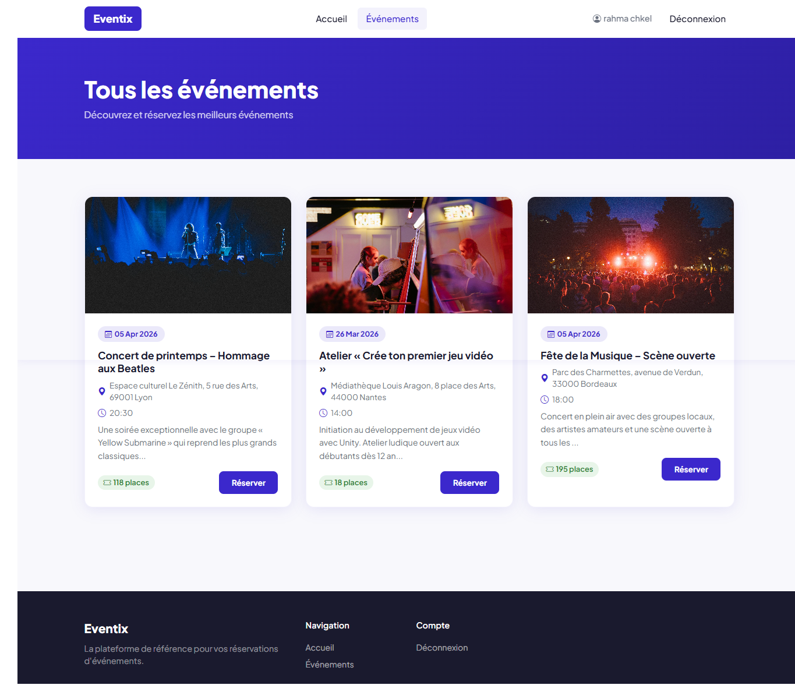
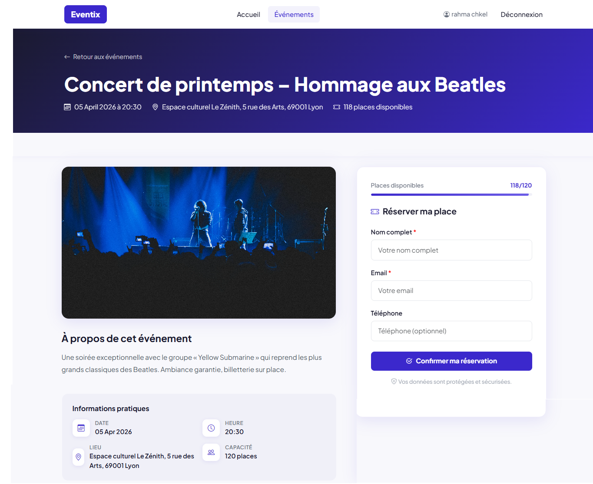
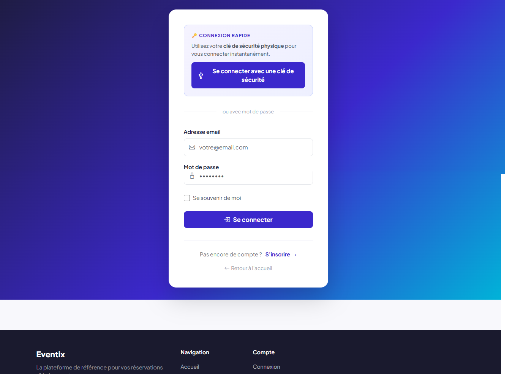
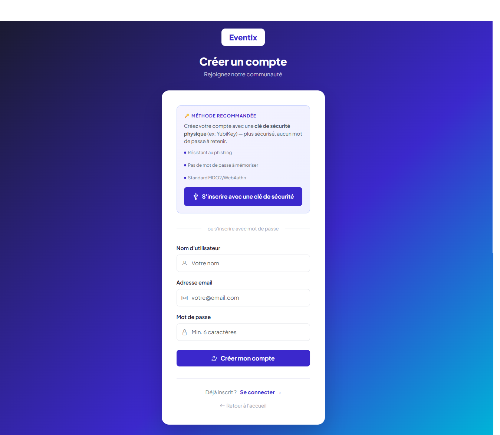
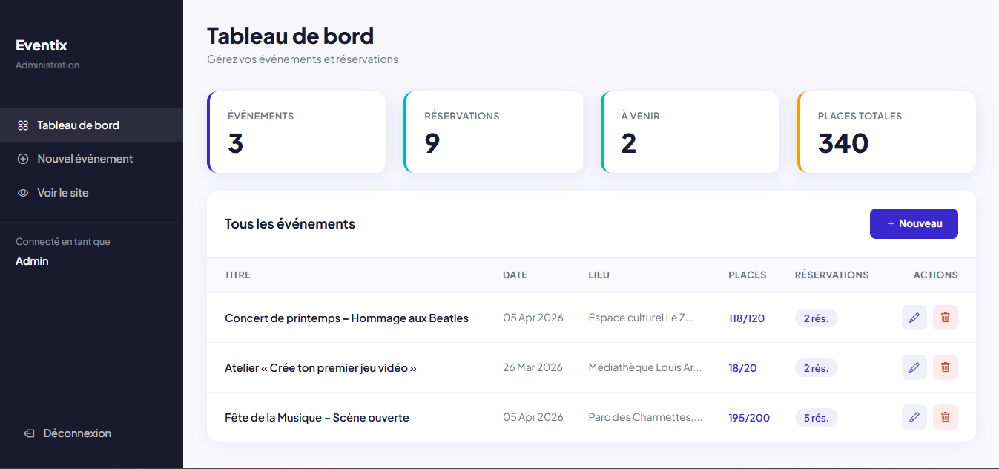
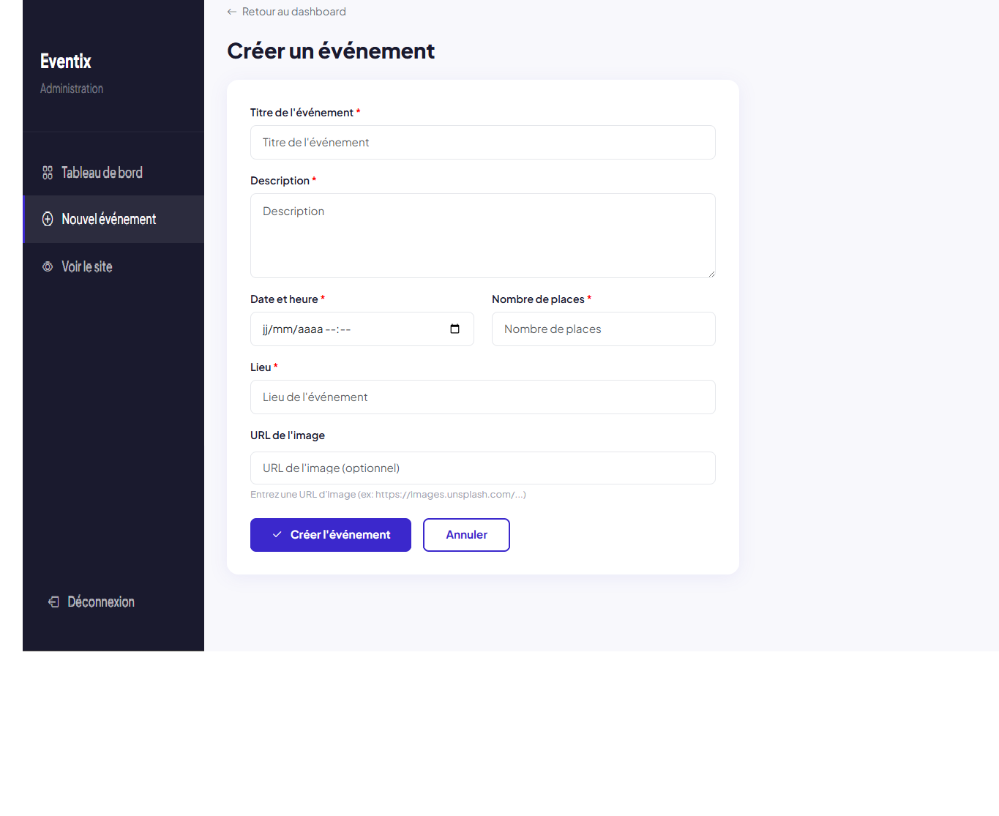

# MiniProjet2A-EventReservation
Application web de gestion de réservations d'évènements qui permet : — À des utilisateurs de consulter des événements et de réserver en ligne, — Et à un administrateur de gérer les événements et les réservations via une interface sécurisée. — Sécurité renforcée avec JWT et Passkeys.
## 📸 Captures d'écran

### Page d'accueil

### Liste des événements

### Réservation

### Connexion 

### Inscription 

### Dashboard Administrateur

### Creation Event Admin

